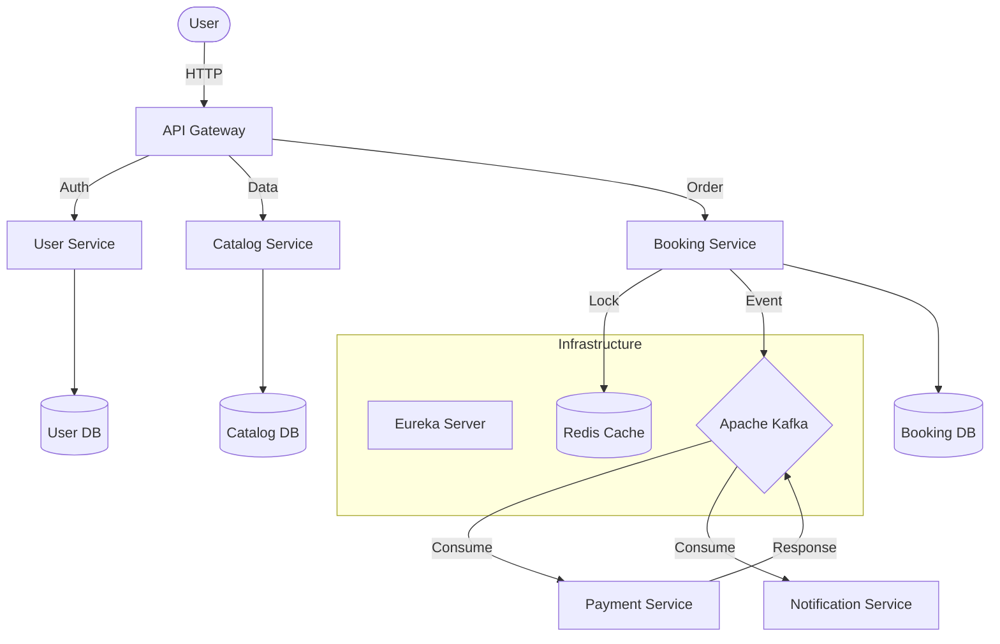
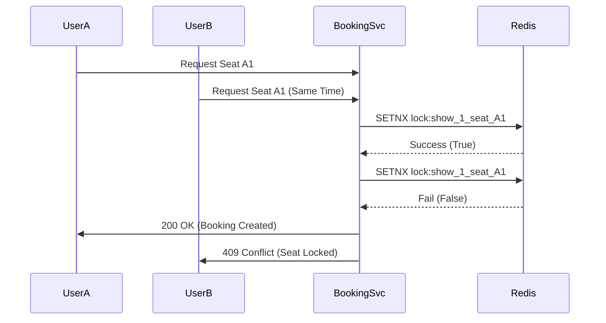

# TicketHub - Event Driven Microservices

TicketHub is a scalable, distributed ticket booking system (BookMyShow clone) built with **Spring Boot 3**, **Apache Kafka**, and **Redis**. It implements the **Saga Design Pattern** for distributed transactions and handles high concurrency using Distributed Locking.

## Key Features

- **Microservices Architecture:** Deployed 7 distinct services using Spring Cloud.
- **Event-Driven Sagas:** Orchestrated booking & payment flows using Kafka.
- **Concurrency Handling:** Solved the "Double Booking" problem using **Redis Distributed Locks**.
- **Gateway & Security:** Centralized API Gateway with JWT Authentication.
- **Service Discovery:** Dynamic scaling with Netflix Eureka.
- **Resilience:** Circuit Breakers and Retry mechanisms.

## Tech Stack

- **Backend:** Java 17, Spring Boot 3.2
- **Messaging:** Apache Kafka, Zookeeper
- **Database:** PostgreSQL (Per-service DB pattern), Redis (Caching & Locking)
- **Infrastructure:** Docker, Docker Compose
- **Testing:** JUnit 5, Mockito, JMeter (Concurrency)

## Architecture

The system consists of the following microservices:

1.  **API Gateway:** Entry point, routing, and SSL termination.
2.  **User Service:** JWT Identity management.
3.  **Catalog Service:** Manages movies, theatres, and shows.
4.  **Booking Service:** Handles ticket reservation and Sagas.
5.  **Payment Service:** Processes mock payments asynchronously.
6.  **Notification Service:** Sends email alerts via SMTP.
7.  **Eureka Server:** Service Registry.



## Concurrency & Distributed Locking

One of the biggest challenges in ticket booking systems is handling **race conditions**: _What happens if two users try to book the same seat at the exact same millisecond?_

To solve this, I implemented **Distributed Locking** using Redis.

### The Problem (Race Condition)

Without locking, two parallel requests could both read the seat status as `AVAILABLE`, pass the check, and overwrite each other, leading to a double booking.

### The Solution (Redis `SETNX`)

Before any booking logic executes, the system attempts to acquire a lock on the specific `showId` + `seatNumber` key in Redis.

1.  **Atomicity:** Redis operations are atomic. Only one thread can successfully set the key.
2.  **TTL (Time To Live):** Locks expire automatically (e.g., 10 mins) to prevent deadlocks if a service crashes.
3.  **Fail-Fast:** If a second user tries to book, the lock acquisition fails immediately, returning an error without hitting the database.



## How to Run

### Prerequisites

- Docker & Docker Compose
- Java 17+ (Optional, if running locally)

### Quick Start (Docker)

1.  Clone the repository:
    ```bash
    git clone [https://github.com/your-username/ticket-hub.git](https://github.com/your-username/ticket-hub.git)
    cd ticket-hub
    ```
2.  Build and run all services:
    ```bash
    docker-compose up --build -d
    ```
3.  Access the services:
    - **Swagger UI:** [http://localhost:8080/swagger-ui.html](http://localhost:8080/swagger-ui.html)
    - **Eureka Dashboard:** [http://localhost:8761](http://localhost:8761)

## API Endpoints

### Auth

| Method   | Endpoint          | Description                               |
| :------- | :---------------- | :---------------------------------------- |
| **POST** | `/auth/register`  | Register a new User                       |
| **POST** | `/auth/login`     | Authenticate & get JWT                    |
| **POST** | `/admin/register` | Register a new Admin (Requires Admin JWT) |
| **GET**  | `/users/status`   | User Service Health Check                 |

### Catalog

| Method   | Endpoint               | Description                                         |
| :------- | :--------------------- | :-------------------------------------------------- |
| **GET**  | `/movies`              | Get all Movies                                      |
| **GET**  | `/movies/{id}`         | Get specific Movie details                          |
| **POST** | `/movies`              | Add a new Movie (Admin)                             |
| **GET**  | `/theatres`            | Get all Theatres                                    |
| **GET**  | `/theatres/{id}`       | Get specific Theatre details                        |
| **POST** | `/theatres`            | Add a new Theatre (Admin)                           |
| **GET**  | `/theatres/{id}/halls` | Get all Halls in a specific Theatre                 |
| **POST** | `/theatres/{id}/halls` | Add a Hall to a Theatre (Admin)                     |
| **PUT**  | `/halls/{id}/seats`    | Configure Seat Layout (Admin)                       |
| **GET**  | `/shows`               | Get all scheduled Shows params(city, movieId, date) |
| **GET**  | `/shows/{id}`          | Get details on a specific Show                      |
| **POST** | `/shows`               | Schedule a Show (Admin)                             |

### Booking

| Method   | Endpoint                  | Description                                      |
| :------- | :------------------------ | :----------------------------------------------- |
| **GET**  | `/bookings`               | Health Check                                     |
| **POST** | `/bookings`               | Create a Booking (Initiates Redis Lock)          |
| **GET**  | `/bookings/{id}`          | Get Booking Status (Pending/Confirmed/Cancelled) |
| **GET**  | `/bookings/show/{showId}` | Get Show Details                                 |
