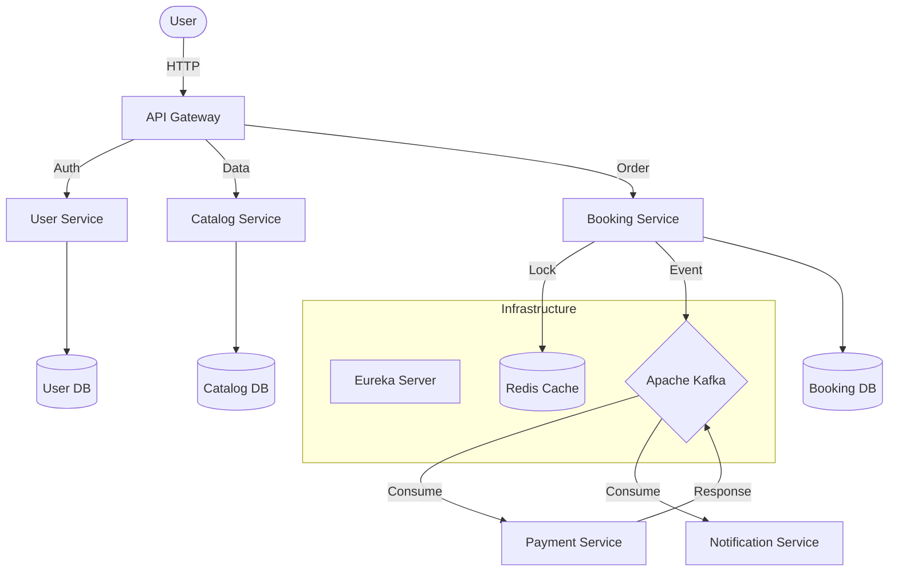
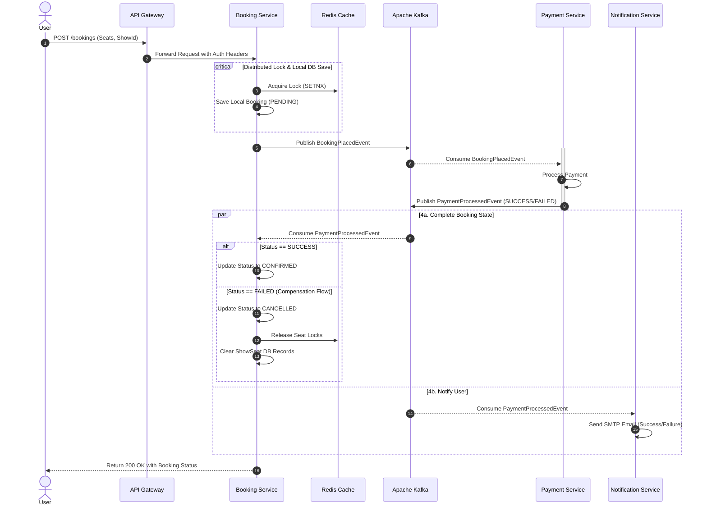

# TicketHub - Event Driven Microservices

TicketHub is a scalable, distributed ticket booking system built with **Spring Boot 3**, **Apache Kafka**, and **Redis**. It implements a **Choreographed Saga Design Pattern** for distributed transactions and handles high concurrency using Redis Distributed Locking.

## Key Features

* **Microservices Architecture:** Deployed modular services using Spring Cloud.
* **Event-Driven Sagas:** Orchestrated asynchronous booking & payment flows using Kafka.
* **Concurrency Handling:** Solved the "Double Booking" race condition using **Redis `SETNX` Locks**.
* **Fault Tolerance & Resilience:** Implemented Resilience4j circuit breakers for synchronous calls and **Dead Letter Queues (DLQ)** for failed Kafka events.
* **Gateway & Security:** Centralized API Gateway with JWT Authentication.
* **Service Discovery:** Dynamic scaling with Netflix Eureka.
* **Global Error Handling:** Standardized REST exception handling across all services.

## Tech Stack

* **Backend:** Java 17, Spring Boot 3.2
* **Messaging:** Apache Kafka, Zookeeper
* **Database:** PostgreSQL (Per-service DB pattern), Redis (Caching & Locking)
* **Infrastructure:** Docker, Docker Compose
* **Resilience:** Resilience4j
* **Observability:** Prometheus, Grafana, Zipkin, Micrometer
* **Testing:** JUnit 5, Mockito, JMeter (Concurrency)

## Architecture Overview

The system consists of the following microservices:

1. **API Gateway:** Entry point, routing, and SSL termination.
2. **User Service:** JWT Identity management.
3. **Catalog Service:** Manages movies, theatres, and shows.
4. **Booking Service:** Handles ticket reservation, locks, and Saga initiation.
5. **Payment Service:** Processes mock payments asynchronously.
6. **Notification Service:** Sends email alerts via SMTP.
7. **Eureka Server:** Service Registry.


```mermaid
graph TD
    User([User]) -->|HTTP| Gateway[API Gateway]

    subgraph Infrastructure
        Eureka[Eureka Server]
        Kafka{Apache Kafka}
        Redis[(Redis Cache)]
    end

    Gateway -->|Auth| UserSvc[User Service]
    Gateway -->|Data| CatalogSvc[Catalog Service]
    Gateway -->|Order| BookingSvc[Booking Service]

    BookingSvc -->|Lock| Redis
    BookingSvc -->|Event| Kafka

    Kafka -->|Consume| PaymentSvc[Payment Service]
    PaymentSvc -->|Response| Kafka

    Kafka -->|Consume| NotifSvc[Notification Service]

    UserSvc --> DB1[(User DB)]
    CatalogSvc --> DB2[(Catalog DB)]
    BookingSvc --> DB3[(Booking DB)]

```

---

## Event-Driven Architecture & Saga Orchestration

TicketHub uses an asynchronous, choreographed **Saga Design Pattern** managed via Apache Kafka to maintain data consistency across distributed services without tight coupling or blocking HTTP calls.

### Kafka Event Schema & Topics

* **`booking-events` Topic:** Published by the Booking Service (`BookingPlacedEvent`). Contains `bookingId`, `userId`, `amount`, and `email`.
* **`payment-events` Topic:** Published by the Payment Service (`PaymentProcessedEvent`). Contains `bookingId`, `status` (SUCCESS/FAILED), and `transactionId`.
* **`*.dlq` Topics (Dead Letter Queues):** Catches unprocessable messages or stalled sagas for manual review and replay.


```mermaid
sequenceDiagram
    autonumber
    actor User
    participant Gateway as API Gateway
    participant BookingSvc as Booking Service
    participant Redis as Redis Cache
    participant Kafka as Apache Kafka
    participant PaymentSvc as Payment Service
    participant NotifSvc as Notification Service

    User->>Gateway: POST /bookings (Seats, ShowId)
    Gateway->>BookingSvc: Forward Request with Auth Headers
    
    critical Distributed Lock & Local DB Save
        BookingSvc->>Redis: Acquire Lock (SETNX)
        BookingSvc->>BookingSvc: Save Local Booking (PENDING)
    end

    BookingSvc->>Kafka: Publish BookingPlacedEvent
    
    activate PaymentSvc
    Kafka-->>PaymentSvc: Consume BookingPlacedEvent
    PaymentSvc->>PaymentSvc: Process Payment
    PaymentSvc->>Kafka: Publish PaymentProcessedEvent (SUCCESS/FAILED)
    deactivate PaymentSvc

    par 4a. Complete Booking State
        Kafka-->>BookingSvc: Consume PaymentProcessedEvent
        alt Status == SUCCESS
            BookingSvc->>BookingSvc: Update Status to CONFIRMED
        else Status == FAILED (Compensation Flow)
            BookingSvc->>BookingSvc: Update Status to CANCELLED
            BookingSvc->>Redis: Release Seat Locks
            BookingSvc->>BookingSvc: Clear ShowSeat DB Records
        end
    and 4b. Notify User
        Kafka-->>NotifSvc: Consume PaymentProcessedEvent
        NotifSvc->>NotifSvc: Send SMTP Email (Success/Failure)
    end

    BookingSvc-->>User: Return 200 OK with Booking Status

```

---

## Concurrency & Distributed Locking

To prevent race conditions (double-booking the same seat), TicketHub implements **Distributed Locking** using Redis `StringRedisTemplate`.

### Implementation Details

1. **Lock Key Generation:** Generates a specific key per seat: `"lock:show:{showId}:seat:{seatNumber}"`.
2. **Atomic Acquisition:** Uses Redis's `setIfAbsent` (`SETNX`) to ensure only one thread successfully acquires the seat.
3. **TTL (Time To Live):** Locks are set with a strict **10-minute TTL** (`Duration.ofMinutes(10)`) to prevent deadlocks if the service crashes mid-transaction.
4. **Fail-Fast Mechanism:** If `setIfAbsent` returns false (seat is taken), the `RedisLockServiceImpl` immediately rolls back any successfully locked seats in the current batch and throws a custom exception. The `GlobalExceptionHandler` translates this into an **HTTP 409 Conflict** response, gracefully rejecting the request and preventing unnecessary database load.

---

## Resilience & Error Handling

* **Global Exception Handling:** All services use a `@RestControllerAdvice` to intercept uncaught runtime exceptions and return a standardized JSON error format (timestamp, status, error, message), preventing stack trace leaks.
* **Circuit Breaking:** Integrated **Resilience4j** to wrap synchronous Feign Client calls (e.g., API Gateway to Catalog Service). This provides failbacks and prevents cascading failures if a downstream service experiences high latency or downtime.
* **Saga Compensation (Rollbacks):** Instead of distributed DB rollbacks, the system handles failures via Kafka events. If the Payment Service fails, it emits a `FAILED` event. The Booking Service automatically reacts by marking the booking `CANCELLED`, releasing Redis locks, and deleting the reserved `ShowSeat` allocations from PostgreSQL.
* **Dead Letter Queues (DLQ):** Unprocessable Kafka events (e.g., deserialization failures or exhausted retry attempts) are automatically routed to DLQ topics to prevent message blockage and allow for manual intervention.

---

## API Endpoints

### User Service (Auth & Identity)

| Method | Endpoint | Description | Request Payload |
| --- | --- | --- | --- |
| **POST** | `/auth/register` | Register a new User | `RegisterRequest` |
| **POST** | `/auth/login` | Authenticate & get JWT | `AuthenticationRequest` |
| **POST** | `/admin/register` | Register an Admin *(Req. `X-User-Role`)* | `RegisterRequest` |
| **GET** | `/users/status` | Health Check | *None* |

### Catalog Service

| Method | Endpoint | Description | Request Payload |
| --- | --- | --- | --- |
| **GET** | `/movies` | Get all Movies | *None* |
| **POST** | `/movies` | Add a new Movie (Admin) | `MovieDto` |
| **GET** | `/theatres` | Get Theatres *(Supports `?city=`)* | *None* |
| **POST** | `/theatres/{id}/halls` | Add a Hall to a Theatre | `HallDto (includes SeatLayout)` |
| **PUT** | `/halls/{id}/seats` | Configure Seat Layout | `SeatLayout` |
| **GET** | `/shows` | Get scheduled Shows *(Params: city, movieId)* | *None* |
| **POST** | `/shows` | Schedule a Show (Admin) | `ScheduleShowRequest` |

### Booking Service

| Method | Endpoint | Description | Request Payload |
| --- | --- | --- | --- |
| **POST** | `/bookings` | Create Booking *(Req. `X-User-Id`, `Email`)* | `CreateBookingRequest` |
| **GET** | `/bookings/{bookingId}` | Get Booking Status | *None* |
| **GET** | `/bookings/show/{showId}` | Get Show Details with locked seats | *None* |

---

## Observability & Monitoring

The system features a healthy service mesh with full telemetry.

* **Prometheus:** Real-time metrics collection from all service `/actuator/prometheus` endpoints.
* **Grafana:** Visualizes JVM health, CPU load, and Kafka consumer lag.
* **Zipkin:** Tracks distributed requests across service boundaries via Trace IDs.

| Tool | URL | Description |
| --- | --- | --- |
| **Grafana** | `http://localhost:3000` | Dashboards (Login: admin/admin) |
| **Prometheus** | `http://localhost:9090` | Metrics & Target Status |
| **Zipkin** | `http://localhost:9411` | Distributed Tracing UI |

---

## How to Run

### Prerequisites

* Docker & Docker Compose
* Java 17+ (Optional, if running locally outside containers)

### Quick Start (Docker)

1. Clone the repository:

```bash
git clone https://github.com/jayantt23/ticket-hub.git
cd ticket-hub/backend

```

2. Build and run all services:

```bash
docker-compose up --build -d

```

3. Access the core services:

* **API Gateway (Entrypoint):** `http://localhost:8080`
* **Eureka Dashboard:** `http://localhost:8761`
